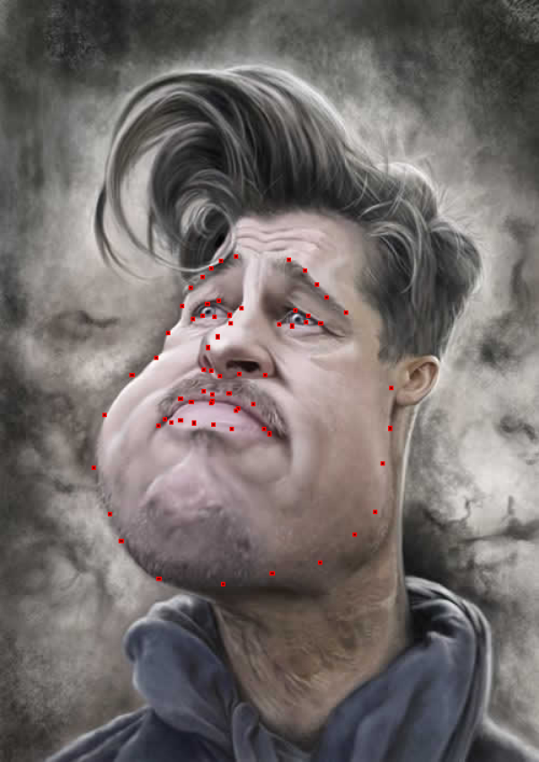

# Caricature-Data
This repository contain the caricature images with corresponding landmark in paper: <a href="https://arxiv.org/abs/1803.06802v2">Alive Caricature from 2D to 3D</a>. 

The <a href= "https://github.com/QianyiWu/Caricature-Data/tree/master/Caricature_w_landmark"> Caricature_w_landmark</a> folder contains the caricature images with its landmarks. We named them by number. e.g. 1.jpg with its landmarks file named 1.txt.

Each text file was organized by x-coordinate and y-coordinate of 68 landmarks. The sequence of landmarks following 
<a href="https://ibug.doc.ic.ac.uk/media/uploads/images/annotpics/figure_68_markup.jpg"> ibug_facial_landmarks.jpg</a>

We provide a python script to read the landmarks file and display them. 

Usage: run <a href= "https://github.com/QianyiWu/Caricature-Data/blob/master/Caricature_w_landmark/read_landmarks.py"> read_landmarks.py</a> in this folder. For example, you want to show the 7-th image's landmarks, you can use:
``` bash
cd ../Caricature_w_landmark
python read_landmarks.py --index 7
```
Dependencies: PIL. 

It should be something like this. Those red points are facial landmarks.



The <a href="https://github.com/QianyiWu/Caricature-Data/tree/master/my_result_Crop"> my_result_Crop</a> folder contains outputs given by our method. 

# Update Log
**Add landmarks index of 3D model:** Add 3D model landmark file <a href="https://github.com/QianyiWu/Caricature-Data/blob/master/landmark_index.txt"> 3D_landmark</a> used in our project. Those data was marked manually and can be edited if necessary.

# Usage
If you have comments or questions, please contact Qianyi Wu (wqy9619@mail.ustc.edu.cn) and Juyong Zhang (juyong@ustc.edu.cn).

# License
Please note that this dataset could be used for research purpose only, and any commercial use of the data is prohibited.

# Citation
Please cite the following paper if this dataset helps your research:
<a href="https://arxiv.org/abs/1803.06802v2">Alive Caricature from 2D to 3D</a>

    @article{wu2018alive
          title={Alive Caricature from 2D to 3D},
          author={Wu, Qianyi and Zhang, Juyong and Lai, Yu-Kun and Zheng, Jianmin and Cai, Jianfei}
          journal={CVPR},
          year={2018}
    }

